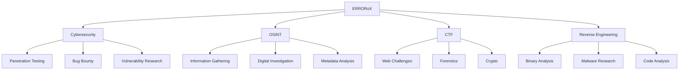

<div align="center">
  


### 🛡️ Энтузиаст OSINT | 🔐 Кибербезопасность | 🏆 CTF Игрок | 🔧 Обратная инженерия

<p align="center">
  
</p>

[](https://github.com/ERRORoX)
[](https://github.com/ERRORoX)
  
</div>

---

### ⚠️ Почему ERRORoX?

<div align="center">

<p align="center">
  
</p>


<p align="center">
  
</p>

</div>

---

### 🎯 Обо мне

<div align="center">
  
<p align="center">
  
</p>
  
```python
class ERRORoX:
    """
    Security Researcher | OSINT Specialist | CTF Player
    Breaking systems to make them stronger since 2022
    """
    
    def __init__(self):
        self.name = "ERROR"
        self.location = "🇹🇯 Tajikistan"
        self.role = "Security Researcher | OSINT Specialist | CTF Player"
        self.motto = "Breaking systems to make them stronger"
        self.tagline = "Every bug hides a hex"
        self.founded = "2022-01-06"
        
    def skills(self):
        return {
            "osint": "🔍 Expert",
            "cybersecurity": "🛡️ Advanced",
            "reverse_engineering": "🔧 Advanced",
            "ctf": "🏆 Active Player",
            "python": "🐍 Proficient",
            "web_development": "🌐 HTML/CSS",
            "ai_integration": "🤖 OpenAI API",
            "docker": "🐳 Containerization",
            "linux": "🐧 Kali Linux Expert"
        }
    
    def current_projects(self):
        return [
            "🤖 Telegram AI Bot Development",
            "🔍 OSINT Tools Development",
            "🛡️ Security Research",
            "🏆 CTF Challenges",
            "📚 Kali Linux Education"
        ]
    
    def contact(self):
        return {
            "github": "https://github.com/ERRORoX",
            "repos": 14,
            "followers": 0,
            "following": 1
        }

if __name__ == "__main__":
    me = ERRORoX()
    print(f"Welcome to {me.name}'s profile!")
    print(f"Location: {me.location}")
    print(f"Status: {me.motto}")
```
  
</div>

---

### 🛠️ Технологический стек

<div align="center">
  
<p align="center">
  
</p>
  
#### 💻 Языки программирования
  


#### 🔐 Cybersecurity & Tools
  


#### 🔧 Инструменты разработки
  


#### 🔍 Специализация
  
| Область | Уровень | Описание |
|---------|---------|----------|
| **OSINT** | 🔍 Expert | Open Source Intelligence Gathering |
| **Reverse Engineering** | 🔧 Advanced | Binary Analysis & Malware Research |
| **Web Security** | 🎯 Advanced | Penetration Testing & Bug Bounty |
| **CTF** | 🏆 Active | Capture The Flag Competitions |
| **AI Integration** | 🤖 Proficient | OpenAI API & LLM Integration |
| **Containerization** | 🐳 Proficient | Docker & Deployment |
| **Digital Forensics** | 📊 Knowledgeable | EXIF Analysis & Investigation |

</div>

---

### 📊 Статистика GitHub

<div align="center">
  
<p align="center">
  
</p>
  
<!-- GitHub Stats Card -->


<!-- GitHub Streak -->


<!-- Top Languages -->


<!-- GitHub Trophies -->


</div>

---

### 🔥 Избранные проекты

<div align="center">
  
<p align="center">
  
</p>
  
#### 🤖 AI & Automation
  
[](https://github.com/ERRORoX/black-bot)
[](https://github.com/ERRORoX/black-bot.v2)
  
#### 🔍 OSINT & Security Tools
  
[](https://github.com/ERRORoX/grabcam)
[](https://github.com/ERRORoX/Kali-Linux-Academy)
  
#### 🔐 Security & Forensics
  
[](https://github.com/ERRORoX/EXIF)
[](https://github.com/ERRORoX/DARKWEB)
  
</div>

---

### 📦 Все проекты (14 публичных репозиториев)

<div align="center">
  
<p align="center">
  
</p>
  
| 🔢 | Проект | Язык | Категория | Описание |
|----|--------|------|-----------|----------|
| 1️⃣ | [**black-bot**](https://github.com/ERRORoX/black-bot) | 🐍 Python | 🤖 AI Bot | Telegram-бот с AI для общения на темы хакерства и Kali Linux |
| 2️⃣ | [**black-bot.v2**](https://github.com/ERRORoX/black-bot.v2) | 🐍 Python | 🤖 AI Bot | Версия 2 Telegram бота с улучшенным функционалом |
| 3️⃣ | [**Kali-Linux-Academy**](https://github.com/ERRORoX/Kali-Linux-Academy) | 🐍 Python | 📚 Education | Образовательные материалы по Kali Linux и безопасности |
| 4️⃣ | [**EXIF**](https://github.com/ERRORoX/EXIF) | 🐍 Python | 🔐 Forensics | Инструмент для работы с EXIF данными и метаданными |
| 5️⃣ | [**grabcam**](https://github.com/ERRORoX/grabcam) | 🌐 HTML | 🔍 OSINT | Веб-инструмент для работы с камерами и веб-разработки |
| 6️⃣ | [**DARKWEB**](https://github.com/ERRORoX/DARKWEB) | 🎨 CSS | 🌑 Dark Web | Проект связанный с темной веб-тематикой и стилями |
| 7️⃣ | [**DARK**](https://github.com/ERRORoX/DARK) | 🌐 HTML | 🌑 Dark Theme | Темная тема проекта для веб-приложений |
| 8️⃣ | [**jarvis1**](https://github.com/ERRORoX/jarvis1) | 🌐 HTML | 🤖 AI Assistant | AI-ассистент проект для автоматизации |
| 9️⃣ | [**server**](https://github.com/ERRORoX/server) | 🌐 HTML | 🖥️ Server | Серверный проект для веб-разработки |
| 🔟 | [**Dilnoz**](https://github.com/ERRORoX/Dilnoz) | 🌐 HTML | 📝 Personal | Личный проект |
| 1️⃣1️⃣ | [**Dilnoza**](https://github.com/ERRORoX/Dilnoza) | 🌐 HTML | 📝 Personal | Личный проект |
| 1️⃣2️⃣ | [**Dilnozaa**](https://github.com/ERRORoX/Dilnozaa) | 🌐 HTML | 📝 Personal | Личный проект |
| 1️⃣3️⃣ | [**bot**](https://github.com/ERRORoX/bot) | - | 🤖 Bot | Бот проект |

</div>

---

### 🎓 Опыт и интересы

<div align="center">
  
<p align="center">
  
</p>
  


</div>

**🔹 OSINT Research** - Сбор и анализ открытой информации для исследований безопасности  
**🔹 Cyber Security** - Исследование уязвимостей и защита систем от атак  
**🔹 CTF Competitions** - Активное участие в соревнованиях Capture The Flag  
**🔹 Reverse Engineering** - Анализ бинарных файлов, malware и защищенных приложений  
**🔹 AI Integration** - Разработка Telegram ботов с использованием OpenAI API и LLM  
**🔹 Penetration Testing** - Тестирование безопасности веб-приложений и систем  
**🔹 Digital Forensics** - Работа с метаданными (EXIF) и расследование инцидентов  
**🔹 Educational Content** - Создание обучающих материалов по Kali Linux и безопасности

---

### 🌟 Навыки и компетенции

<div align="center">
  
<p align="center">
  
</p>
  
| Навык | Уровень | Статус |
|-------|---------|--------|
| **OSINT** | 🔍 Expert | ✅ Активно использую |
| **Reverse Engineering** | 🔧 Advanced | ✅ Активно использую |
| **Web Security** | 🎯 Advanced | ✅ Активно использую |
| **Python Development** | 🐍 Proficient | ✅ Активно использую |
| **AI/ML Integration** | 🤖 Proficient | ✅ Активно использую |
| **Docker** | 🐳 Proficient | ✅ Активно использую |
| **Linux Administration** | 🐧 Expert | ✅ Активно использую |
| **CTF** | 🏆 Active Player | ✅ Регулярно участвую |
| **Bug Bounty** | 🐛 Knowledgeable | ⚡ Изучаю |
| **Web Development** | 🌐 Proficient | ✅ Активно использую |

</div>

---

### 📈 Вклад в безопасность

<div align="center">
  
<p align="center">
  
</p>
  


**📊 Статистика коммитов за последний год:**


</div>

---

### 🔐 Сфера деятельности

<div align="center">
  
<p align="center">
  
</p>
  
```
🛡️ Cybersecurity Research & Development
│
├── 🔍 OSINT Gathering & Analysis
│   ├── Information Collection
│   ├── Digital Investigation
│   └── Metadata Extraction
│
├── 🤖 AI-Powered Security Tools
│   ├── Telegram Bots
│   ├── OpenAI Integration
│   └── LLM Applications
│
├── 🔧 Reverse Engineering  
│   ├── Binary Analysis
│   ├── Malware Research
│   └── Code Decompilation
│
├── 🎯 Penetration Testing
│   ├── Web Application Security
│   ├── Network Security
│   └── Vulnerability Assessment
│
├── 🏆 CTF Competitions
│   ├── Web Challenges
│   ├── Forensics
│   ├── Crypto
│   └── Reverse Engineering
│
├── 🐛 Bug Bounty Hunting
│   ├── Vulnerability Discovery
│   ├── Responsible Disclosure
│   └── Security Research
│
├── 📚 Educational Content
│   ├── Kali Linux Tutorials
│   ├── Security Guides
│   └── Tool Documentation
│
└── 🐳 Containerization & Deployment
    ├── Docker
    ├── Container Management
    └── CI/CD Integration
```

</div>

---

### 🎯 Текущая активность

<div align="center">
  
<p align="center">
  
</p>
  
| Деятельность | Статус | Описание |
|--------------|--------|----------|
| 🔭 **Работаю над** | 🟢 Активно | Улучшением AI-ботов и OSINT инструментов |
| 🌱 **Изучаю** | 🟡 В процессе | Новые методы reverse engineering и обхода защиты |
| 👯 **Открыт к сотрудничеству** | 🟢 Доступен | В проектах безопасности и OSINT |
| 🤔 **Ищу помощь с** | 🟠 Нужна помощь | Продвинутыми техниками обхода защиты и malware анализом |
| 💬 **Спросите меня о** | 🟢 Доступен | OSINT, Cyber Security, CTF, Reverse Engineering, AI Integration |
| 📫 **Связаться** | 🟢 Доступен | [GitHub Profile](https://github.com/ERRORoX) |
| ⚡ **Интересный факт** | 💡 | Каждый баг скрывает hex код, и я их нахожу |

</div>

---

### 🤝 Связь со мной

<div align="center">
  
[](https://github.com/ERRORoX)
[](https://github.com/ERRORoX)
[](https://github.com/ERRORoX)

**📧 Связаться:** Откройте issue в любом из моих репозиториев или напишите мне на GitHub

**⚠️ Помните:** Используйте свои знания ответственно. Только этичный хакинг!

</div>

---

### 🎯 Цели и планы

<div align="center">
  
<p align="center">
  
</p>
  
- [ ] 🎯 Продолжать развиваться в области OSINT и безопасности
- [ ] 🏆 Участвовать в крупных CTF соревнованиях и конкурсах
- [ ] 🌟 Внести вклад в open-source security проекты
- [ ] 🐛 Получить признание в сообществе bug bounty
- [ ] 🛠️ Разработать собственные инструменты для безопасности
- [ ] 🤖 Улучшить AI-боты с расширенным функционалом
- [ ] 📚 Создать больше обучающих материалов по Kali Linux
- [ ] 🔐 Получить сертификаты по кибербезопасности
- [ ] 🌐 Развивать веб-инструменты для OSINT

</div>

---

### 💡 Любимые цитаты

<div align="center">
  
> **"The quieter you become, the more you are able to hear."**  
> *— Kali Linux*

> **"Security is not a product, but a process."**  
> *— Bruce Schneier*

> **"The only secure system is one that is powered off, cast in a block of concrete and sealed in a lead-lined room with armed guards."**  
> *— Gene Spafford*

> **"Breaking systems to make them stronger"**  
> *— ERRORoX*

> **"Every bug hides a hex"**  
> *— ERRORoX*

</div>

---

### 🔥 Интересные факты

<div align="center">
  
<p align="center">
  
</p>
  
| Факт | Описание |
|------|----------|
| 🖥️ | Люблю взламывать системы, чтобы сделать их безопаснее |
| 🔍 | Каждый баг скрывает hex код, и я их нахожу |
| 🛡️ | Защищаю, исследуя уязвимости |
| 🎯 | Фокус на этичном хакинге и безопасности |
| 🤖 | Интегрирую AI в инструменты безопасности |
| 🐳 | Использую Docker для развертывания проектов |
| ☕ | Код, безопасность и кофе - идеальное сочетание |
| 🇹🇯 | Работаю из Таджикистана |

</div>

---

### 📊 Активность GitHub

<div align="center">
  
**📈 Детальная статистика:**


**📦 Репозитории:**


**👥 Социальная активность:**


**⭐ Вклад в сообщество:**


</div>

---

<div align="center">
  
<p align="center">
  
</p>
  
### ⚡ Забавная статистика


  
---
  
**👀 Просмотры профиля:**
  

  
---
  
### 🐍 Моя статистика коммитов


  
---
  
### 🎨 GitHub Profile Views


  
---
  
⭐️ **От [ERRORoX](https://github.com/ERRORoX)**
  
**Сделано с ❤️ и 🔐 мыслями о безопасности**
  
**⚠️ Помните: Используйте свои силы ответственно. Только этичный хакинг!**
  
**🔒 Всегда оставайтесь любознательными, безопасными и этичными.**
  
**💻 Взламываю системы, чтобы сделать их сильнее | ERRORoX — где каждый баг скрывает hex**

</div>
